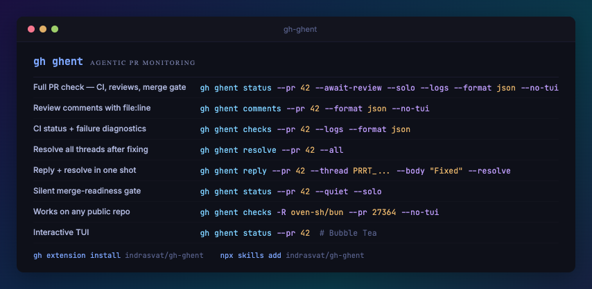

<p align="center">
  
  <br><br>
  <strong>Agentic PR monitoring for GitHub</strong>
  <br>
  <em>Interactive TUI for humans, structured output for AI agents</em>
  <br><br>
  <a href="#install">Install</a> · <a href="#quick-start">Quick Start</a> · <a href="#how-it-works">How It Works</a> · <a href="#commands">Commands</a> · <a href="#global-flags">Global Flags</a> · <a href="#agent-integration">Agent Integration</a> · <a href="#for-ai-agents-agent-skill">Agent Skill</a> · <a href="#development">Development</a>
</p>

## Install

Requires [GitHub CLI](https://cli.github.com/) (`gh`) v2.0+.

```bash
gh extension install indrasvat/gh-ghent
```

## Quick Start

```bash
# See unresolved review threads
gh ghent comments --pr 42

# Check CI status
gh ghent checks --pr 42

# Full PR dashboard with merge readiness
gh ghent summary --pr 42
```

## How It Works

ghent detects your environment automatically:

- **TTY** (interactive terminal) — launches a Bubble Tea TUI with keyboard navigation, tabs, and expandable views
- **Piped / `--no-tui`** — outputs structured data (JSON by default) for scripts and AI agents

No configuration needed. Authentication is inherited from `gh auth`.

## Commands

### `gh ghent comments`

Show unresolved review threads for a PR.

```bash
gh ghent comments --pr 42                    # Interactive TUI
gh ghent comments --pr 42 --format json      # JSON for agents
gh ghent comments --pr 42 --format json | jq '.unresolved_count'
```

| Flag | Description |
|------|-------------|
| `--pr` | Pull request number (required) |

Exit codes: `0` = no unresolved threads, `1` = has unresolved threads.

### `gh ghent checks`

Show CI check runs, status, and annotations.

```bash
gh ghent checks --pr 42                      # Interactive TUI
gh ghent checks --pr 42 --logs               # Include error logs
gh ghent checks --pr 42 --watch              # Poll until complete
gh ghent checks --pr 42 --format json | jq '.overall_status'
```

| Flag | Description |
|------|-------------|
| `--pr` | Pull request number (required) |
| `--logs` | Include failing job log excerpts in output |
| `--watch` | Poll until all checks complete, fail-fast on failure |

Exit codes: `0` = all pass, `1` = failure, `3` = pending.

### `gh ghent resolve`

Resolve or unresolve review threads.

```bash
gh ghent resolve --pr 42 --thread PRRT_abc123        # Single thread
gh ghent resolve --pr 42 --all                        # All threads
gh ghent resolve --pr 42 --thread PRRT_abc123 --unresolve  # Reopen
```

| Flag | Description |
|------|-------------|
| `--pr` | Pull request number (required) |
| `--thread` | Thread ID to resolve (PRRT_... node ID) |
| `--all` | Resolve all unresolved threads |
| `--unresolve` | Unresolve instead of resolve |

Exit codes: `0` = all success, `1` = partial failure, `2` = total failure.

### `gh ghent reply`

Reply to a review thread. Designed for AI agent use.

```bash
gh ghent reply --pr 42 --thread PRRT_abc123 --body "Fixed in latest commit"
gh ghent reply --pr 42 --thread PRRT_abc123 --body-file response.md
echo "Acknowledged" | gh ghent reply --pr 42 --thread PRRT_abc123 --body-file -
```

| Flag | Description |
|------|-------------|
| `--pr` | Pull request number (required) |
| `--thread` | Thread ID to reply to (required) |
| `--body` | Reply body text (supports markdown) |
| `--body-file` | Read reply body from file (`-` for stdin) |

Exit codes: `0` = reply posted, `1` = thread not found, `2` = error.

### `gh ghent summary`

Combined PR status dashboard with merge-readiness assessment.

```bash
gh ghent summary --pr 42                     # Interactive dashboard
gh ghent summary --pr 42 --logs --format json  # Full status with failure diagnostics
gh ghent summary --pr 42 --watch --format json # Wait for CI, then full report
gh ghent summary --pr 42 --quiet               # Silent merge-readiness gate
```

| Flag | Description |
|------|-------------|
| `--pr` | Pull request number (required) |
| `--logs` | Include failing job log excerpts and annotations |
| `--watch` | Poll until CI completes, then output full summary |
| `--quiet` | Silent on merge-ready (exit 0), full output on not-ready (exit 1) |
| `--compact` | One-line-per-thread compact digest for agents |

Merge-ready when: no unresolved threads + all checks pass + at least one approval.

Exit codes: `0` = merge-ready, `1` = not merge-ready.

## Global Flags

These flags work with all commands:

| Flag | Short | Description | Default |
|------|-------|-------------|---------|
| `--repo` | `-R` | Repository in OWNER/REPO format | current repo |
| `--format` | `-f` | Output format: `json`, `md`, `xml` | `json` |
| `--no-tui` | | Force pipe mode even in TTY | `false` |
| `--verbose` | | Show additional context | `false` |
| `--debug` | | Debug logging to stderr | `false` |
| `--pr` | | Pull request number | |

## Agent Integration

ghent is built for AI coding agents. Use `--no-tui --format json` for reliable structured output.

### JSON Output

```bash
# Get unresolved threads with IDs for resolution
gh ghent comments --pr 42 --format json --no-tui

# Check CI and get failure details
gh ghent checks --pr 42 --format json --logs --no-tui

# One-shot merge readiness
gh ghent summary --pr 42 --format json --no-tui | jq '.is_merge_ready'
```

### Exit Codes

All commands use meaningful exit codes for scripting:

| Code | Meaning |
|------|---------|
| `0` | Success / pass / merge-ready |
| `1` | Action needed (unresolved threads, check failure, not merge-ready) |
| `2` | Error (API failure, auth, permissions) |
| `3` | Pending (checks still running) |

### Agent Workflow Example

```bash
# 1. Get everything in one call with failure diagnostics
SUMMARY=$(gh ghent summary --pr 42 --logs --format json --no-tui)

# 2. Check merge readiness
echo "$SUMMARY" | jq -e '.is_merge_ready' && exit 0

# 3. Read CI failures (annotations + log excerpts)
echo "$SUMMARY" | jq '.checks.checks[] | select(.conclusion=="failure") | {name, log_excerpt, annotations}'

# 4. Read unresolved review threads
echo "$SUMMARY" | jq '.comments.threads[] | {path, line, body: .comments[0].body}'

# 5. Fix code, then resolve + reply
gh ghent resolve --pr 42 --all --format json

# 6. Wait for CI, get fresh summary
gh ghent summary --pr 42 --watch --logs --format json --no-tui
```

### Output Formats

**JSON** (default) — machine-readable, works with `jq`:
```bash
gh ghent checks --pr 42 --format json
```

**Markdown** — human-readable piped output:
```bash
gh ghent comments --pr 42 --format md
```

**XML** — structured markup:
```bash
gh ghent checks --pr 42 --format xml
```

## For AI Agents (Agent Skill)

ghent ships an [Agent Skill](https://agentskills.io) so AI coding agents (Claude Code, Codex, Cursor, Cline, Copilot, Amp, etc.) can discover and use it automatically.

```bash
npx skills add indrasvat/gh-ghent
```

The skill teaches agents when and how to use ghent — triggering conditions, pipe-mode commands, JSON output parsing, exit code branching, and complete review-fix-resolve workflows. See [`skill/SKILL.md`](skill/SKILL.md) for the full skill content.

## Development

```bash
make build     # Build binary
make test      # Run tests
make lint      # Run linter
make ci        # Full CI check (lint + test + vet)
make install   # Build and register as gh extension
```

## License

MIT
